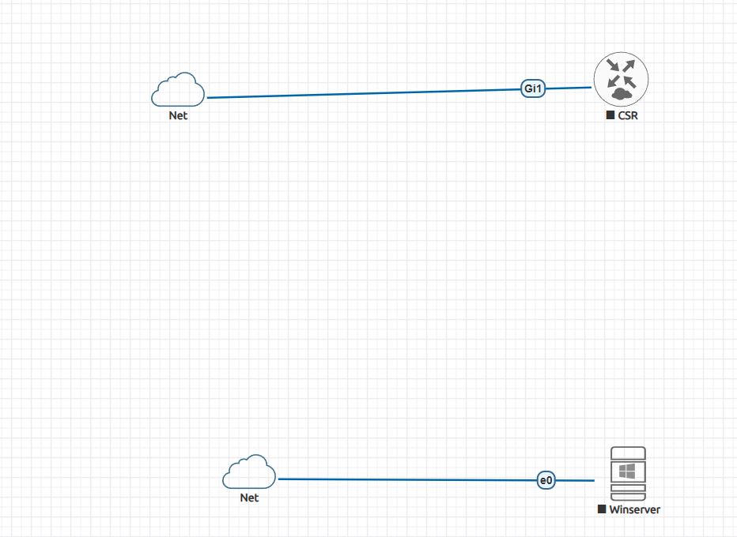

# 🛡️ Enterprise Vulnerability Management & Audit Lab (Nessus Expert)

## 📌 Project Overview
A comprehensive security auditing project focused on identifying, analyzing, and suggesting remediations for vulnerabilities across a hybrid enterprise infrastructure. This lab simulates a real-world environment including Windows Active Directory, Cisco Networking, and Web Applications.

---

## 🏗️ Lab Architecture & Topology
The environment was built using **VMware Workstation** and **EVE-NG**, bridging virtual nodes with the host machine for deep-packet inspection and scanning.

* **Virtualization:** VMware Workstation Pro & EVE-NG
* **Scanner:** Nessus Expert (Self-Hosted)

### 📸 Network Topology
 

---

### 1. Windows Server 2012 R2 (Baseline Security Audit)
* **Scenario:** Domain Controller with Active Directory and DNS enabled.
* **Audit Focus:** Assessing security posture with **Windows Defender & Firewall ON**.
* **Key Findings:** Identified legacy protocol risks and missing OS patches.

### 2. Windows Server 2012 R2 (Hardened vs. Exposed Comparison) 🛡️ ❌
* **Scenario:** Same Domain Controller but with **Windows Defender & Firewall DISABLED**.
* **Audit Focus:** Visualizing the massive increase in attack surface when built-in security is removed.
* **Key Findings:** **165 Critical & 394 High** vulnerabilities (Huge jump compared to Scan 1). 
* **Insight:** Demonstrates the critical importance of host-based firewalls in an AD environment.

### 3. Cisco CSR1000v (Infrastructure Audit) 🌐
* **Scenario:** Cisco IOS-XE Router in EVE-NG.
* **Audit Focus:** Identifying insecure management protocols (Telnet/SNMP/HTTP).
* **Key Findings:** Clear-text credentials and Public SNMP communities.

### 4. Mutillidae Web Application (AppSec Audit) 💻
* **Scenario:** Vulnerable Web App for testing OWASP Top 10.
* **Audit Focus:** Web Application Scanning (WAS) for SQLi and XSS.
* **Key Findings:** Critical injection points and broken access control.

## 📊 Vulnerability Dashboard
| Target Asset | OS/Platform | Critical | High | Main Security Gap |
| :--- | :--- | :---: | :---: | :--- |
| **AD-DNS Server** | Windows 2012 R2 | 165 | 394 | Outdated OS & Disabled Firewall |
| **Cisco Router** | IOS-XE | 12 | 15 | Insecure Management (Telnet) |
| **Web App** | Linux/Apache | 25 | 40 | Lack of Input Validation |

---

## 🛠️ Remediations & Best Practices
Based on the audit, the following hardening steps were recommended:
* **Patch Management:** Immediate deployment of missing KB updates.
* **Protocol Hardening:** Disabling Telnet/HTTP and enabling SSH/HTTPS.
* **Service Security:** Changing default SNMP community strings and implementing "Least Privilege" for AD users.

---

## 📁 Repository Structure
* `Scans-PDF-Reports/`: Full technical audit reports in PDF format.
* `Topology-Screenshots/`: Visual representation of the lab setup.
* `Vulnerability-Dashboards/`: Nessus scan result highlights.
